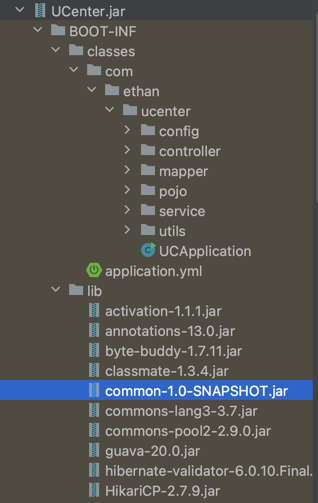

# UCenter 公共组件说明

用户中心模块，集成用户注册、邮箱验证、用户登录、Token 鉴权、管理 API 等功能

可抽离作为独立模块即插即用，抽离时需注意 ucenter 依赖了 common，需要将 common 一并抽离或者先将 common 合并

最佳实践：客户端调用 UC 功能时，建议由业务后端做一下中转，不要让客户端直接向 UC 发送请求、这样可以使业务后端第一时间拿到用户状态，比如是否是本业务的新用户，否则只能在用户进入首页后才能判断

## 更新计划

### 2.0

- CheckStyle: 请求参数不要用驼峰命名；约定参数类型，不要统一 String，会加大服务端出错风险
- 安全性：Token 放在请求头里，不是当做明参传进来（QA 已实现）
- 可维护性：重构，函数尽量复用，开关单独抽类
- 可维护性：补充 Log
- 稳定性：分支流程多加一些校验
- 功能需求：用户名、邮箱、头像支持更改
- 安全性：登录时 Token 返回 MD5，调整 Redis 结构

### 3.0

- 安全性：IP 防御细化
- 功能需求：利用 AppInfo 表的 AppSecret 数据
- 内容校验全部在 Controller 完成

## 关键知识整理
### POJO

PO 指的是数据库直接映射过去的类，一张表就是对应项目中一个 PO

VO 指的是业务对象，在具体业务场景需要被打包成一个类，比如登录时的 LoginVO

### SpringBoot异步

首先要有线程池UCThreadPool，指定某个方法可以获取到一个线程池实例，给这个方法加上 @Bean("[name]") 注解

如果某个方法想要发送给该线程池执行，在方法上加 @Async("[name]") 注解

注意：调用 @Async 方法的地方不能和 @Async 方法在同一个类，否则失效

### DAO

Mapper.xml 中就是自己扩展的功能 SQL 语句，比如左右连接等，MyBatisPlus 提供的基础功能之外的

### Controller

没用的可以删除，没有什么影响，Service 不要乱删

### Service

凡是继承了 ServiceImpl 基类的 Service 都是直接对应数据库表的，没用也不要乱删，操作该表就要通过这些 Service

没继承 ServiceImpl 的 Service 是我自定义的业务 Service

可复用的 Service 方法就不要返回 RR，尽量以基本数据类型返回，因为其他地方还会用到；不复用的可以直接返回 RR 给 Controller

### Lombok

在 POJO 类上打个@Data 注解就免写 Getter/Setter

### JWT

JwtUtil 已整理完毕，以后可以复用

### 邮件发送

EmailSender 已整理完毕，以后可以复用

### Redis

尽量使用 String ---> String

Redis服务器连接密码是个临时密码，如果 Redis 重启需要进入容器输入 config set requirepass [password] 重新设置

### SpringBoot 项目打包部署

多模块项目中，ucenter 和 common 同属 EQA，ucenter 依赖了 common，打包时需要先对根模块EQA执行 Maven install，再对ucenter 执行 maven package

在最终生成的项目JAR 中，可以看到 common 被自动打成了 JAR 依赖

